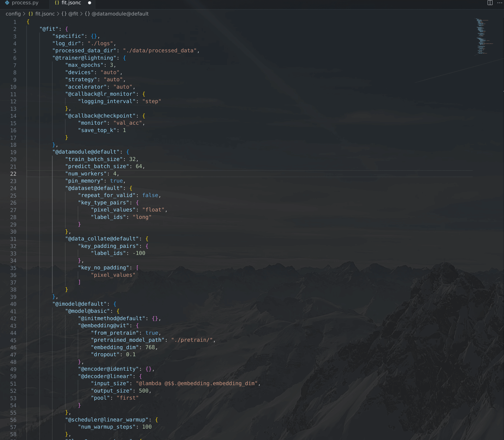
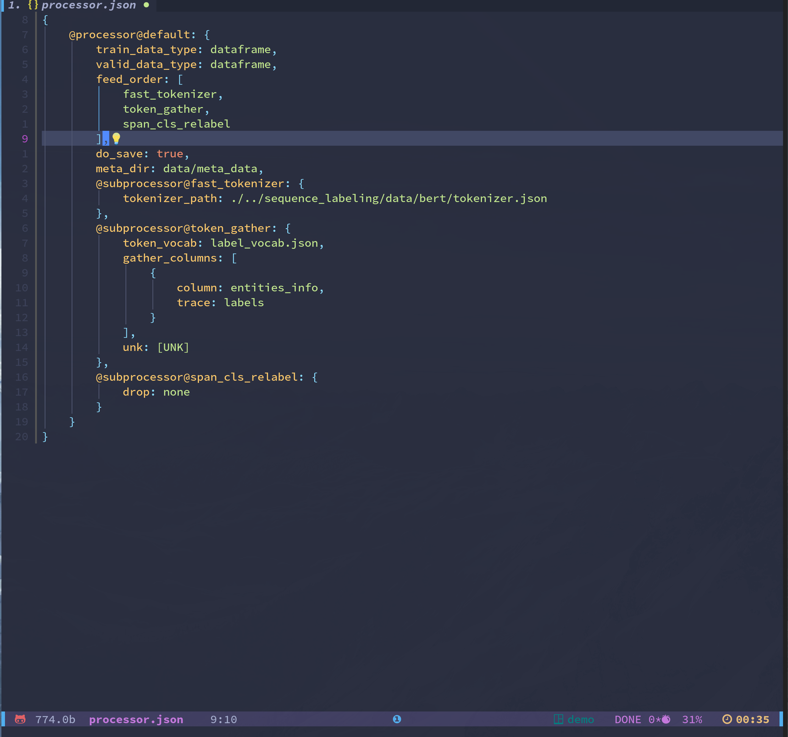

<p align="center">
  <h2 align="center"> Deep Learning toolKit (dlk)</h2>
</p>


<h3 align="center">
    <p>Don't Repeat Yourself</p>
</h3>

<div style="text-align:center">
<span style="width:80%;display:inline-block">


</div>

<h4 align="center">
    <p>
        <b>简体中文</b> |
        <a href="https://github.com/cstsunfu/dlk/blob/main/README_en.md">English</a>
    </p>
</h4>

```
dlk                                  --
├── adv_method                       -- adversarial training method like free_lb, fgm, etc.
├── callback                         -- callbacks, like checkpoint, early_stop, etc.
├── data                             -- data processor part
│   ├── data_collate                 -- data collate for collate a batch of data from dataset to dataloader
│   ├── datamodule                   -- the datamodule a.k.a lightning.LightningDataModule
│   ├── dataset                      -- the dataset inherit the torch.Dataset
│   ├── postprocessor                -- the tasks postprocessor
│   ├── processor                    -- the default processor, which scheduler the subprocessors
│   └── subprocessor                 -- the subprocessors like tokenizer, token2id, etc.
├── display                          -- the tasks display setting
├── imodel                           -- the integrated model, which a.k.a the lightning.LightningModule
├── initmethod                       -- the initmethod, some classic parameter init methods
├── nn                               -- builtin nn modules
│   ├── base_module.py               --
│   ├── layer                        --
│   │   ├── decoder                  --
│   │   ├── embedding                --
│   │   ├── encoder                  --
│   │   └── token_gen_decoder        --
│   ├── loss                         --
│   ├── model                        --
│   ├── module                       --
│   └── utils                        --
├── token_sample                     -- for text generate, different sample strategies
├── optimizer                        -- optimizers
├── scheduler                        -- learning rate schedulers
├── trainer                          -- the trainer, a.k.a lightning.Trainer
├── utils                            --
├── preprocess.py                    -- preprocess datas for train|predict|demo|etc.
├── train.py                         -- train entry
├── online.py                        --
├── predict.py                       -- just predict a bunch of data using the pretrained model
├── server.py                        -- deploy this to server your pretrained model
├── demo.py                          -- demo main
└── version.txt                      --
```


* [Install](#install)
* [Demo](#demo)
    * [Grid Search](#grid-search)
    * [Task Demo](#task-demo)
* [Usage and Feature](#usage-and-feature)
    * [使用方法](#使用方法)
    * [模块注册](#模块注册)
    * [部分内置模块介绍](#部分内置模块介绍)
        * [callback](#callback)
        * [虚拟对抗训练](#虚拟对抗训练)
        * [复杂训练控制](#复杂训练控制)
        * [文本生成](#文本生成)
    * [实现你自己的模型](#你自己的模型)
    * [More Document](#more-document)


虽然最近的一年多通用大模型吸引了大部分人的注意力，但是相信很多人已经意识到任务导向的模型在现阶段仍有其不可替代的一面，而且这些模型在处理某些特定任务时具有更好的可靠性和更高的效率，特别是这些模型可以实现一些Agent来与LLM进行配合。

任务导向的模型开发实际上不像LLM一样可以“一招鲜吃遍天”，而是每个任务的模型都需要针对性的开发，而在工作中我们经常需要对深度神经网络模型进行快速实验，搜索最优结构和参数，并将最优模型进行部署，有时还需要做出demo进行验证.

首先是不同任务的开发实际上有很大一部分是重复的，而同一个任务的训练、预测、部署和demo这几个步骤的核心代码也是一致的，但是在实现上都需要一定的的改动，如果每个步骤都独立开发的话，会使得整个过程非常割裂，而这造成的代码冗余对于长期的代码维护是灾难性的。

`DLK`是一个使用`lightning`的`Trainer`，`intc`为`config`管理系统的集模型训练、参数（架构）搜索、模型预测、模型部署和`demo`为一身，对于同一个模型实现这些功能只需要依赖一份代码，大大降低开发和维护成本.

同时`DLK`作为一个通用的训练框架，我们的各种训练技巧和增强方法也可以非常方便的用于不同的模型, 为此`DLK`内置了很多有用的组件。

除了基础组件之外，`DLK`还为主要的任务提供了丰富的示例，更多的示例会慢慢添加进来

### You Can Edit Your DLK Config Like Python Code

基于[intc](https://github.com/cstsunfu/intc) 所提供的强大的Config管理能力, 你可以像编写python代码一样编写你的config文件

<div style="display:inline-block">
  
  
</div>


### Install


```bash
pip install dlk == 0.1.0

# or clone this repo and cd to the project root dir
pip install .
```

### Demo

下面是一些基于`dlk`开发的示例:

NOTE: 由于我目前只有一台拥有一张`AMD Radeon VII 16G`的GPU和32G内存的个人PC，算力十分有限，因此这里示例的参数很多都还没有优化至SOTA


#### Grid Search

`dlk`基于`intc`进行开发，因此同样提供了参数搜索的能力，而`intc`的`_search`并不仅限于数值类型的参数搜索，也可以对整个模块进行搜索，因此`dlk`实际上也具有模块级的架构搜索能力

`./examples/grid_search_exp`里面提供了一个对超参数进行搜索的示例

训练完模型之后执行：

```bash
tensorboard --logdir ./logs
```

<div style="display:inline-block">
  
  
</div>

#### Task Demo

Demo 均位于`examples`目录下，训练完模型后执行：

```bash
streamlit run ./demo.py
```

<div style="display:inline-block">
  
  
</div>

<div style="display:inline-block">
  
  
</div>


<div style="display:inline-block">
  
  
</div>

<div style="display:inline-block">
  
  
</div>

### Usage and Feature

#### 使用方法

一般来说一个常见的`dlk`开发任务包含两个pipeline，即数据预处理pipeline和模型推理pipeline. *实际上这两个步骤是可以放到同一个pipeline中的, 当前示例中的大多数任务都需要对预处理数据的复用，因此使用两个pipeline*

数据预处理pipeline对应的内置入口是`dlk.preprocess.Process`，我们需要编写`process.jsonc` config文件来对预处理过程(训练、推理、deploy过程全都复用同一个文件，因此配置文件中有针对不同`stage`的不同设置)进行配置并初始化`Process`, 将数据传入并执行`run`即可按要求输出预处理好的数据

模型训练pipeline对应的内置入口是`dlk.train.Train`, 我们需要编写`fit.jsonc` config文件来对模型训练（推理和deploy过程也同样复用这个文件），使用配置文件初始化`Train`之后执行`run`即可获得训练好的模型。

demo则只需要导入训练过程中相同的`process.jsonc`和`fit.jsonc`以及训练好的模型（由`checkpoint` callback组件保存）即可

模型部署只需将`dlk.server.Server`实例化，分发到对应的服务器，通过`Server.fit`接受单条或一个batch的数据即可（TODO: 示例）


#### 模块注册

DLK依赖两个注册系统，一套是`intc`的`config`注册`cregister`，一套是`dlk`自己的模块注册，注册原则是一致的，都是将一个模块以`module_type`和`module_name`为`key`注册到注册器中，之所以选择两层的命名作为`key`是因为这样更方便区分不同的模块类型

以`dlk.nn.layer.embedding.static` 为例，我们将`StaticEmbeddingConfig` 作为`StaticEmbedding`的`config`以`("embedding", "static")`为key注册到`intc`的`cregister`中，以同样的`key`将`StaticEmbedding`注册到`dlk`的模块注册器`register`中。

使用注册器的好处是，我们可以不必关注具体类在哪里实现，只要知道注册的名称就可以直接获取这个类，这使得我们可以非常方便的在任意位置扩展`embedding`的类型，对于我们在自己的项目里面扩展`dlk`非常重要，注册模块对于`intc`也同样重要。在我们已知`StaticEmbedding`的注册名的情况下，获取这个模块的方法非常简单，可以直接`register.get("embedding", "static")`即可，而不必关注他的实际存储位置(`cregister`也有同样的功能)


#### 部分内置模块介绍

##### callback

`dlk`的`Trainer`是基于`lightning.Trainer`实现的，因此`dlk`同样可以使用`lightning`提供的`callback`, `dlk.callback`中包含一些常用的`callback`

##### 虚拟对抗训练

`Adversarial Training`是一种常见的提升模型效果的技巧，`dlk`内置了一些常用的针对`embedding`的`adv`方法(`dlk.adv_method`)，`./examples/adv_exp`是一个使用示例

##### 复杂训练控制

`dlk`的`dlk.scheduler`模块提供了多种的训练`scheduler`， `dlk.nn.loss`模块中的`multi_loss`同样针对多个`loss`提供了自由控制各种`loss`的能力

##### 文本生成

`dlk`还参考`fairseq`的实现，实现了多种的`token_sample`方法，为文本生成提供非常强大的控制能力

#### 实现你自己的模型

参考`./examples/001_first_example` 实现你自己的模型

看完例子之后。但你可能会有疑问，这似乎并不比我直接实现一个模型简单，甚至有很多概念让我觉得这看起来更复杂。
是的，如果你只是想训练一个简单的模型，不需要考虑预测、演示等，没错，但是`dlk`提供了一个非常统一的框架，让你只需按照步骤来实现相应的组件，就可以获得一个可用的模型。并且所有的工作都是可重用的，包括你刚刚实现的组件。

而且`dlk`还提供了很多优化方面的工具，让你不是止步于简单模型

记住这个包的原则是Donot Repeat Yourself


#### More Document

TODO
