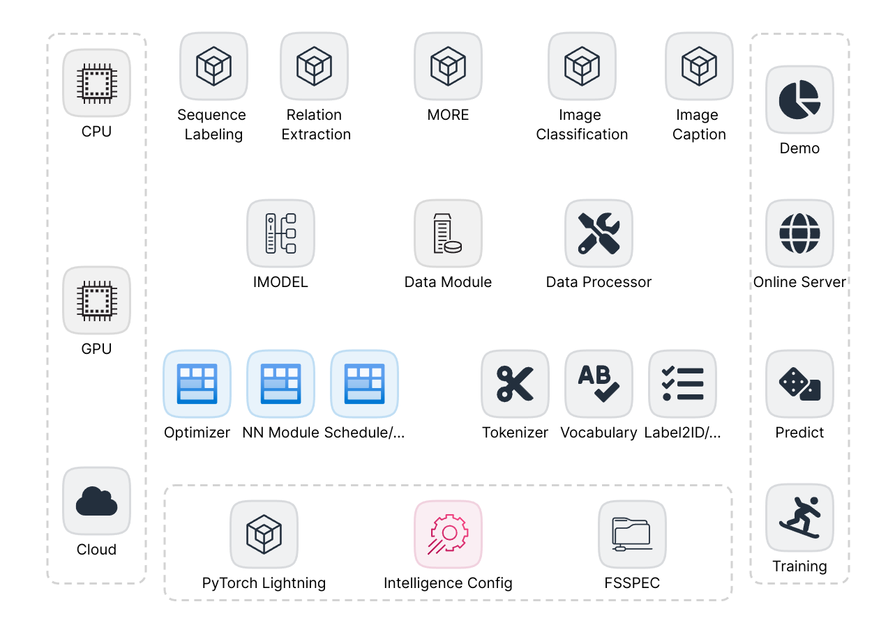
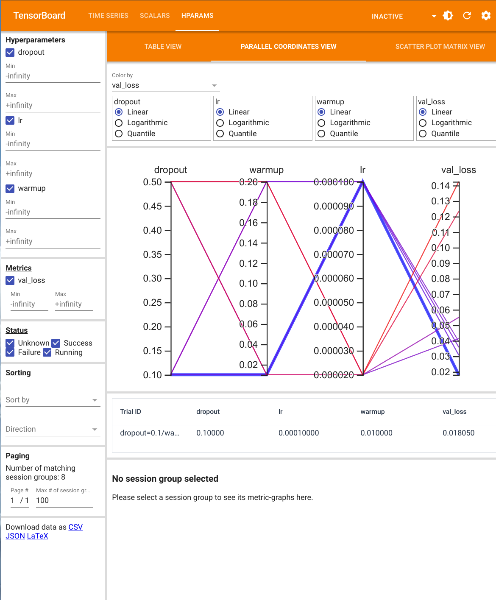
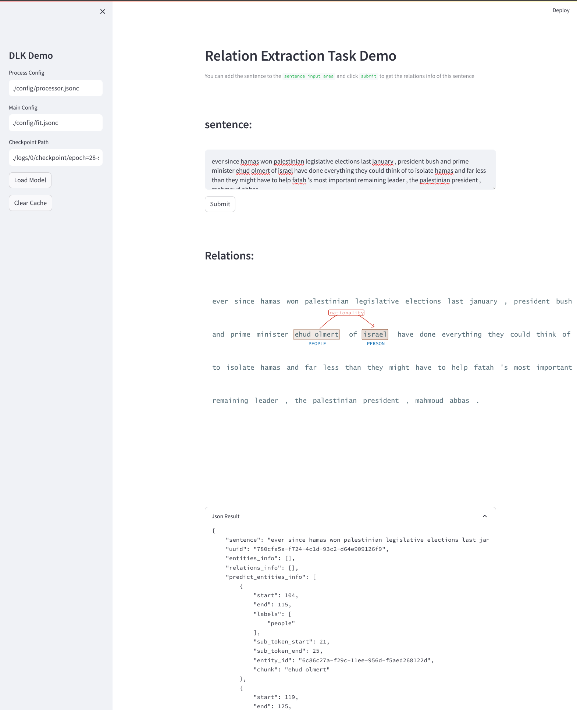
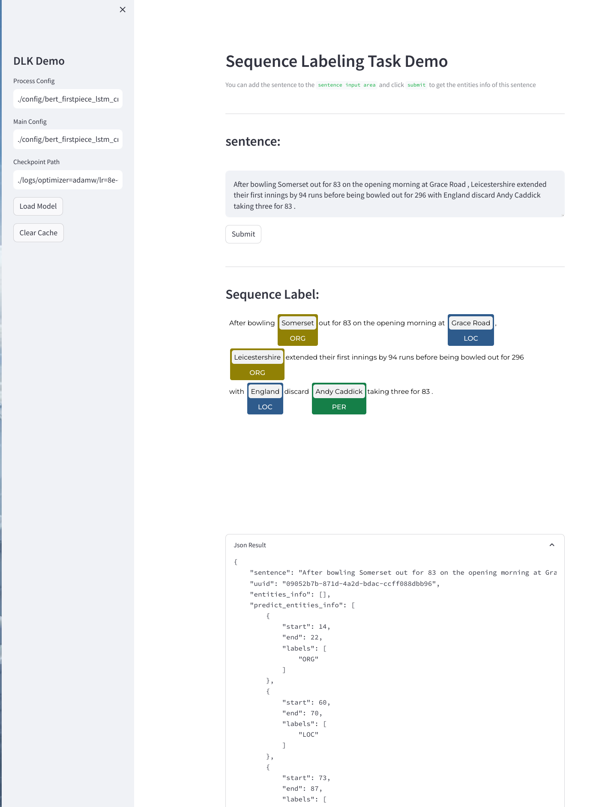
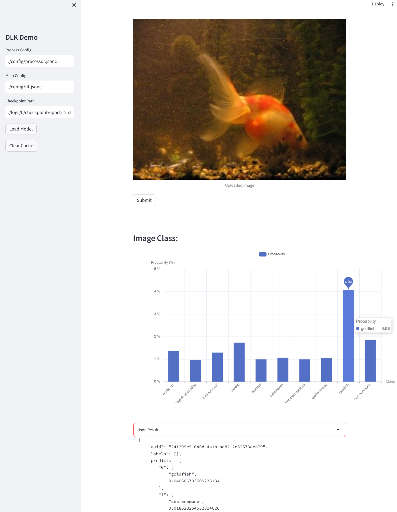
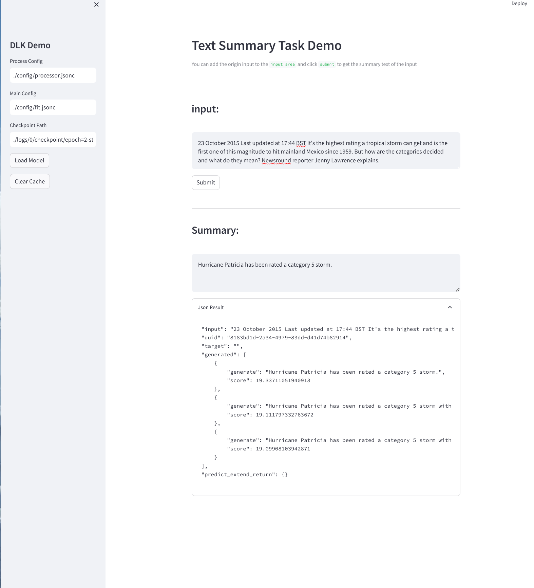
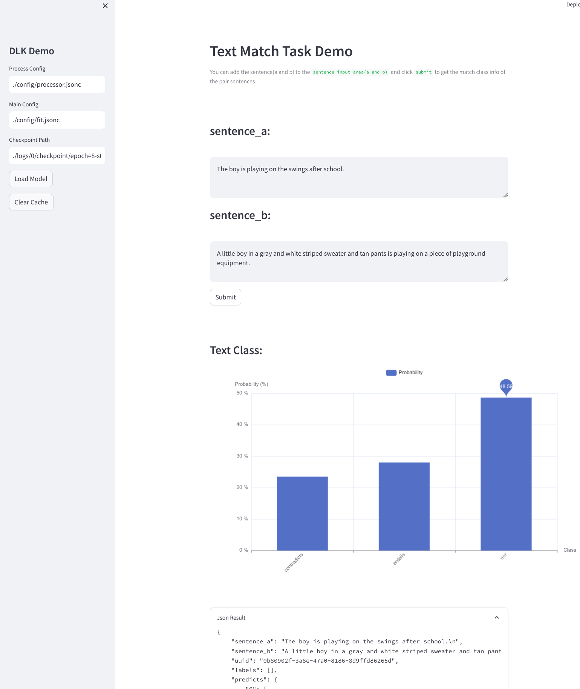
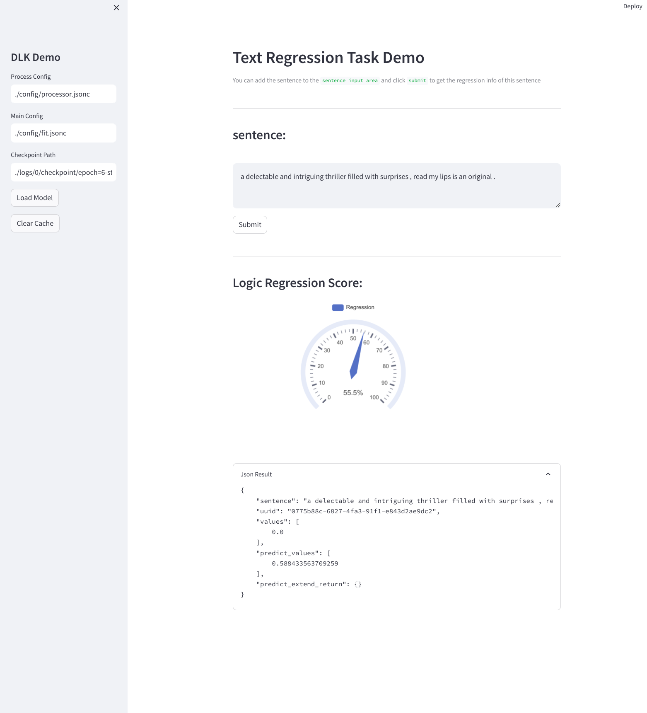
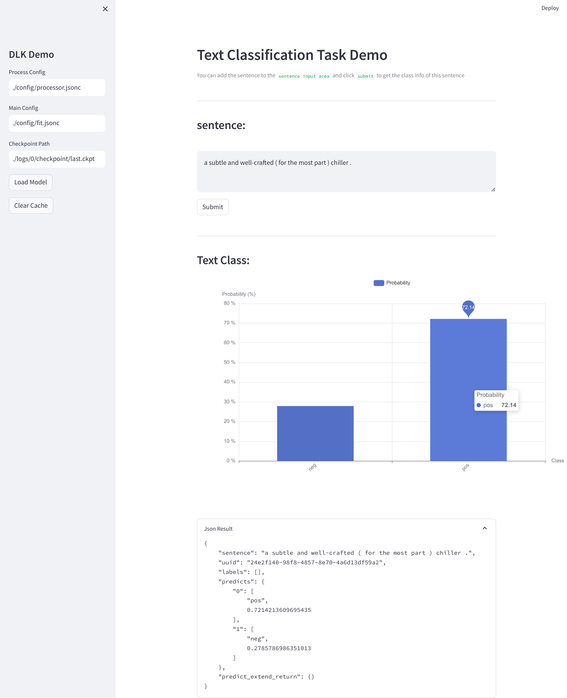

<p align="center">
  <h2 align="center"> Deep Learning toolKit (dlk)</h2>
</p>


<div style="text-align:center">
<span style="width:80%;display:inline-block">



</div>

<h4 align="center">
    <p>
        <b>English</b> |
        <a href="https://github.com/cstsunfu/dlk/blob/main/README_zh.md">简体中文</a>
    </p>
</h4>


* [Install](#install)
* [Demo](#demo)
    * [Grid Search](#grid-search)
    * [Task Demo](#task-demo)
* [Usage and Features](#usage-and-features)
    * [Usage](#usage)
    * [Module Registration](#module-registration)
    * [Some Built-in Modules Introduction](#some-built-in-modules-introduction)
        * [Callbacks](#callbacks)
        * [Adversarial Training](#adversarial-training)
        * [Complex Training Control](#complex-training-control)
        * [Text Generation](#text-generation)
    * [More Documentation](#more-documentation)


In our work, we often need to conduct rapid experiments on deep neural network models, search for optimal structures and parameters, and deploy the optimal models. Sometimes, we also need to create demos for validation.

The core code for training, prediction, deployment, and demo steps is the same, but implementations require certain modifications. This makes the development process very fragmented, and the resulting code redundancy is disastrous for long-term code maintenance.

`DLK` is a toolkit that uses `lightning`'s `Trainer` and `intc` as the configuration management system, integrating model training, parameter (architecture) search, model prediction, model deployment, and demo functionalities into one. For implementing these functions for the same model, only one set of code is required, greatly reducing development and maintenance costs.

At the same time, as a universal training framework, `DLK`'s various training techniques and enhancement methods can also be conveniently used for different models. For this reason, `DLK` includes many useful components.

In addition to the basic components, `DLK` also provides rich examples for major tasks, with more examples gradually being added.

### Install


```bash
pip install dlk == 0.1.0

# or clone this repo and cd to the project root dir
pip install .
```

### Demo

Below are some examples developed based on `dlk`:

NOTE: Since I currently only have a personal PC with one `AMD Radeon VII 16G` GPU and 32GB of memory, the computing power is very limited. Therefore, many parameters in the examples here have not been optimized to SOTA.

#### Grid Search

`dlk`, based on `intc`, also provides parameter search capabilities. And `intc`'s `_search` is not limited to numerical parameter search; it can also search the entire module. Therefore, `dlk` actually also has module-level architecture search capabilities.

An example of searching for hyperparameters is provided in `./examples/grid_search_exp`.

<div style="text-align:center">
<span style="width:47%;display:inline-block">



</span>
<span style="width:47%;display:inline-block">


</span>
</div>

#### Task Demo

<div style="text-align:center">
<span style="width:47%;display:inline-block">



</span>
<span style="width:47%;display:inline-block">



</span>
</div>

<div style="text-align:center">
<span style="width:47%;display:inline-block">



</span>
<span style="width:47%;display:inline-block">


</span>
</div>

<div style="text-align:center">
<span style="width:47%;display:inline-block">



</span>
<span style="width:47%;display:inline-block">



</span>
</div>

<div style="text-align:center">
<span style="width:47%;display:inline-block">



</span>

<span style="width:47%;display:inline-block">



</span>
</div>

### Usage and Features

#### Usage

Generally, a common `dlk` development task consists of two pipelines: data preprocessing pipeline and model inference pipeline. *In fact, these two steps can be placed in the same pipeline. However, most tasks in the current examples require reuse of preprocessed data, so two pipelines are used.*

The built-in entry point for the data preprocessing pipeline is `dlk.preprocess.Process`. We need to write a `process.jsonc` config file to configure the preprocessing process (the training, inference, and deploy processes all reuse the same file, so there are different settings for different `stages` in the configuration file) and initialize `Process` to input the data and execute `run` to output the preprocessed data as required.

The built-in entry point for the model training pipeline is `dlk.train.Train`. We need to write a `fit.jsonc` config file to configure model training (the inference and deploy processes also reuse this file), use the configuration file to initialize `Train`, and then execute `run` to obtain the trained model.

For demos, we only need to import the same `process.jsonc` and `fit.jsonc` used in the training process, along with the trained model (saved by the `checkpoint` callback component).

Model deployment only requires instantiating `dlk.server.Server`, distributing it to the corresponding server, and accepting single or batch data through `Server.fit` (TODO: Example).

#### Module Registration

DLK depends on two registration systems: one is the `config` registration `cregister` of `intc`, and the other is the module registration of DLK itself. The registration principles are consistent, registering a module with `module_type` and `module_name` as the `key` into the registry. The reason for choosing a two-layer naming scheme as the `key` is because it is more convenient to distinguish different module types.

Taking `dlk.nn.layer.embedding.static` as an example, we register `StaticEmbeddingConfig` as `StaticEmbedding`'s `config` with `("embedding", "static")` as the key into `intc`'s `cregister`, and we register `StaticEmbedding` with the same key into DLK's module registry `register`.

The advantage of using registries is that we don't need to be concerned about where a specific class is implemented. We just need to know the registered name to directly obtain this class, which makes it very convenient to extend embedding types in any location. This is important for extending DLK in our own projects, and module registration is equally important for `intc`. Given the registered name of `StaticEmbedding`, obtaining this module is very simple; you can just use `register.get("embedding", "static")`, without needing to know its actual storage location (`cregister` also has the same function).

#### Some Built-in Modules Introduction

##### Callbacks

`dlk`'s `Trainer` is implemented based on `lightning.Trainer`. Therefore, `dlk` can also use the callbacks provided by `lightning`. `dlk.callback` contains some commonly used callbacks.

##### Adversarial Training

`Adversarial Training` is a common technique for improving model performance. DLK includes some commonly used `adv` methods for `embedding` (`dlk.adv_method`). `./examples/adv_exp` is an example of usage.

##### Complex Training Control

`dlk.scheduler` module provides various training schedulers, and `multi_loss` in `dlk.nn.loss` module also provides the ability to freely control various losses for multiple losses.

##### Text Generation

DLK also implements various `token_sample` methods, inspired by `fairseq`, providing powerful control capabilities for text generation.

#### More Documentation

TODO
