<p align="center">
  <h2 align="center"> Deep Learning toolKit (dlk)</h2>
</p>


<h3 align="center">
    <p>Don't Repeat Yourself</p>
</h3>

<div style="text-align:center">
<span style="width:80%;display:inline-block">

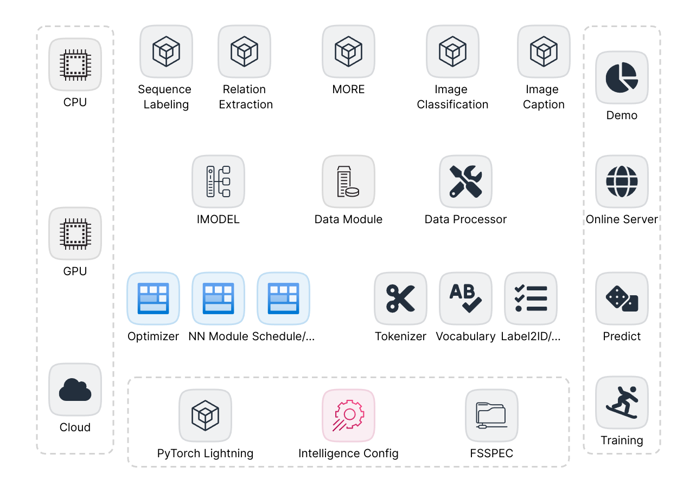

</div>

<h4 align="center">
    <p>
        <b>简体中文</b> |
        <a href="https://github.com/cstsunfu/dlk/blob/main/README_en.md">English</a>
    </p>
</h4>

```markdown
dlk                                  --
├── adv_method                       -- adversarial training method like free_lb, fgm, etc.
├── callback                         -- callbacks, like checkpoint, early_stop, etc.
├── data                             -- data processor part (Powered by HuggingFace datasets)
│   ├── data_collate                 -- data collate for collate a batch of data from dataset to dataloader
│   ├── datamodule                   -- the datamodule a.k.a lightning.LightningDataModule
│   ├── dataset                      -- the dataset inherit the torch.Dataset
│   ├── postprocessor                -- the tasks postprocessor
│   ├── processor                    -- the default processor, which scheduler the subprocessors
│   └── subprocessor                 -- the subprocessors like tokenizer, token2id, etc.
├── display                          -- the tasks display setting
├── imodel                           -- the integrated model, which a.k.a the lightning.LightningModule
├── initmethod                       -- the initmethod, some classic parameter init methods
├── nn                               -- builtin nn modules
│   ├── base_module.py               --
│   ├── layer                        --
│   │   ├── decoder                  --
│   │   ├── embedding                --
│   │   ├── encoder                  --
│   │   └── token_gen_decoder        --
│   ├── loss                         --
│   ├── model                        --
│   ├── module                       --
│   └── utils                        --
├── token_sample                     -- for text generate, different sample strategies
├── optimizer                        -- optimizers
├── scheduler                        -- learning rate schedulers
├── trainer                          -- the trainer, a.k.a lightning.Trainer
├── utils                            --
├── preprocess.py                    -- preprocess datas for train|predict|demo|etc.
├── train.py                         -- train entry
├── online.py                        --
├── predict.py                       -- just predict a bunch of data using the pretrained model
├── server.py                        -- deploy this to server your pretrained model
├── demo.py                          -- demo main
└── version.txt                      --


* [Install](#install)
* [Demo](#demo)
    * [Grid Search](#grid-search)
    * [Task Demo](#task-demo)
* [Usage and Feature](#usage-and-feature)
    * [核心特性](#核心特性)
    * [使用方法](#使用方法)
    * [模块注册](#模块注册)
    * [部分内置模块介绍](#部分内置模块介绍)
        * [callback](#callback)
        * [虚拟对抗训练](#虚拟对抗训练)
        * [复杂训练控制](#复杂训练控制)
        * [文本生成](#文本生成)
    * [实现你自己的模型](#实现你自己的模型)
    * [More Document](#more-document)


虽然最近的一年多通用大模型吸引了大部分人的注意力，但是相信很多人已经意识到任务导向的模型在现阶段仍有其不可替代的一面，而且这些模型在处理某些特定任务时具有更好的可靠性和更高的效率，特别是这些模型可以实现一些Agent来与LLM进行配合。

任务导向的模型开发实际上不像LLM一样可以“一招鲜吃遍天”，而是每个任务的模型都需要针对性的开发，而在工作中我们经常需要对深度神经网络模型进行快速实验，搜索最优结构和参数，并将最优模型进行部署，有时还需要做出demo进行验证.

首先是不同任务的开发实际上有很大一部分是重复的，而同一个任务的训练、预测、部署和demo这几个步骤的核心代码也是一致的，但是在实现上都需要一定的的改动，如果每个步骤都独立开发的话，会使得整个过程非常割裂，而这造成的代码冗余对于长期的代码维护是灾难性的。

`DLK`是一个使用`lightning`的`Trainer`，`intc`为`config`管理系统的集模型训练、参数（架构）搜索、模型预测、模型部署和`demo`为一身，对于同一个模型实现这些功能只需要依赖一份代码，大大降低开发和维护成本.

同时`DLK`作为一个通用的训练框架，我们的各种训练技巧和增强方法也可以非常方便的用于不同的模型, 为此`DLK`内置了很多有用的组件。

除了基础组件之外，`DLK`还为主要的任务提供了丰富的示例，更多的示例会慢慢添加进来

### You Can Edit Your DLK Config Like Python Code

基于[intc](https://github.com/cstsunfu/intc) 所提供的强大的Config管理能力, 你可以像编写python代码一样编写你的config文件

<div style="display:inline-block">
  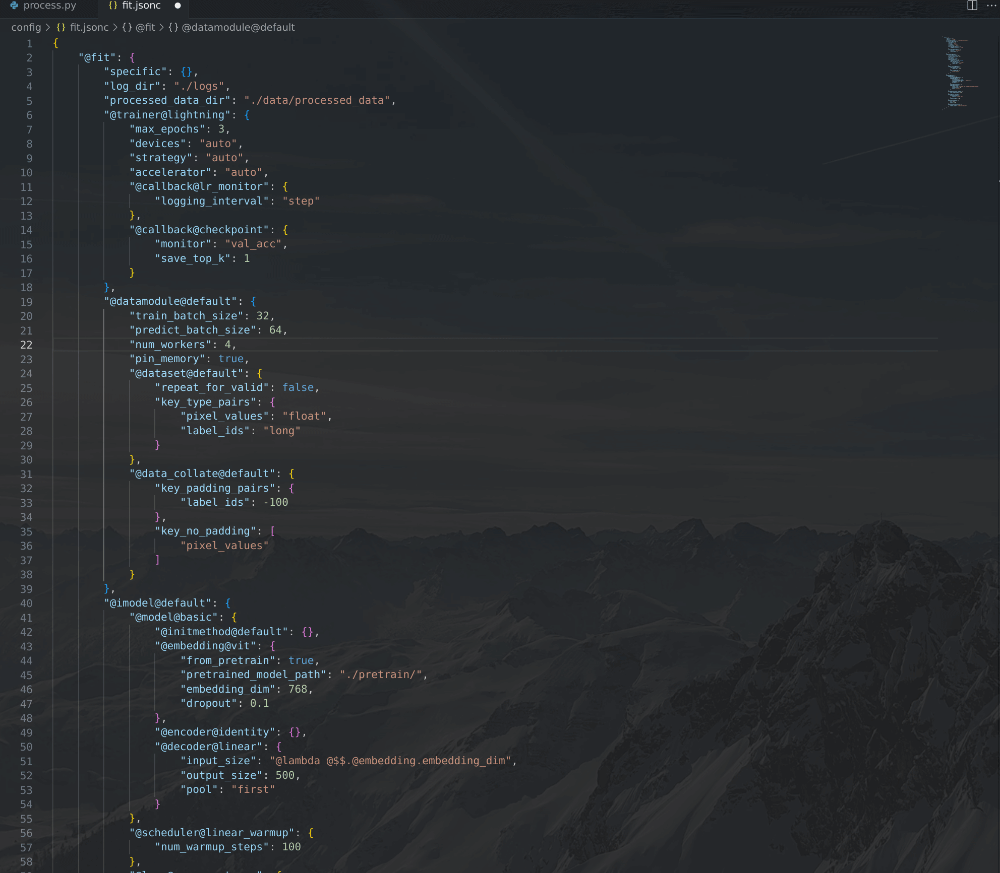
  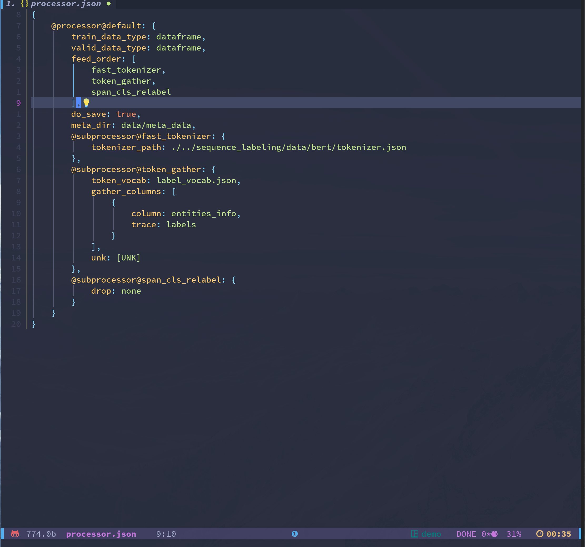
</div>


### Install


```bash
pip install dlk

# or clone this repo and cd to the project root dir
pip install .
```

### Demo

下面是一些基于`dlk`开发的示例:

NOTE: 由于我目前只有一台拥有一张`AMD Radeon VII 16G`的GPU和32G内存的个人PC，算力十分有限，因此这里示例的参数很多都还没有优化至SOTA


#### Grid Search

`dlk`基于`intc`进行开发，因此同样提供了参数搜索的能力，而`intc`的`_search`并不仅限于数值类型的参数搜索，也可以对整个模块进行搜索，因此`dlk`实际上也具有模块级的架构搜索能力

`./examples/grid_search_exp`里面提供了一个对超参数进行搜索的示例

训练完模型之后执行：

```bash
tensorboard --logdir ./logs
```

<div style="display:inline-block">
  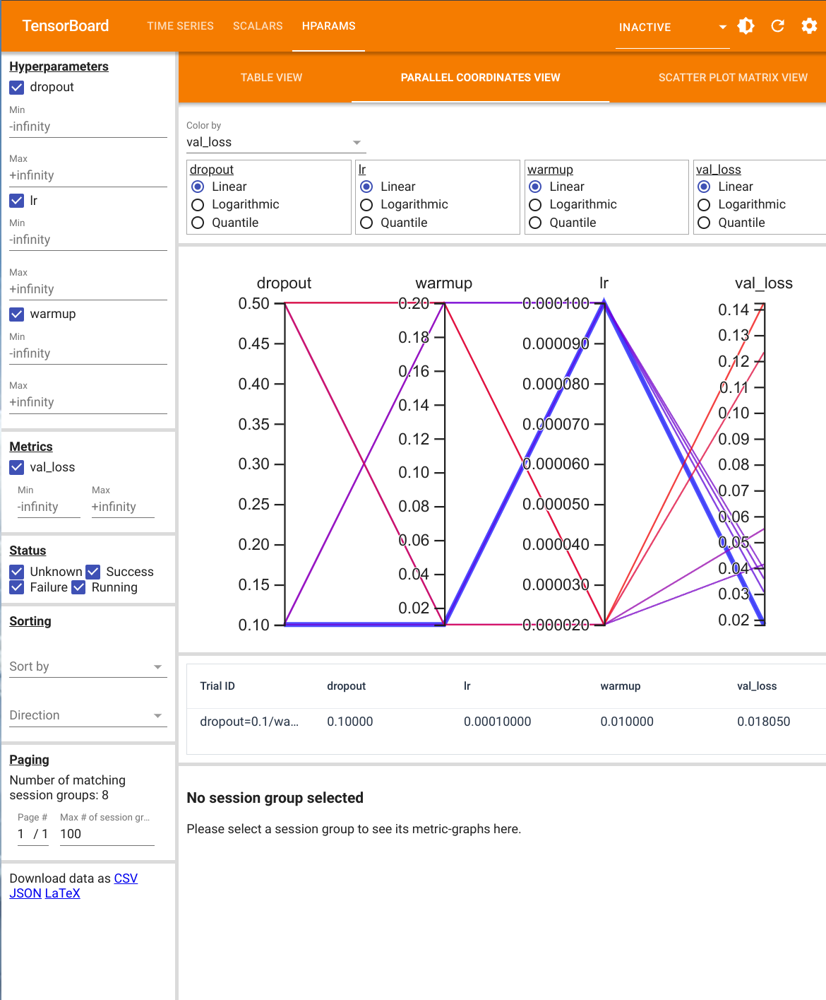
  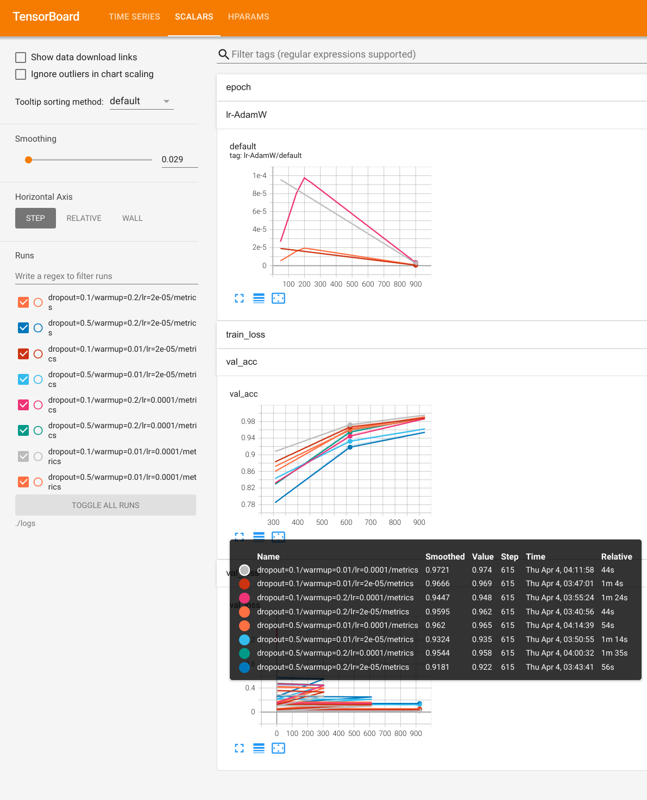
</div>

#### Task Demo

Demo 均位于`examples`目录下，训练完模型后执行：

```bash
streamlit run ./demo.py
```

<div style="display:inline-block">
  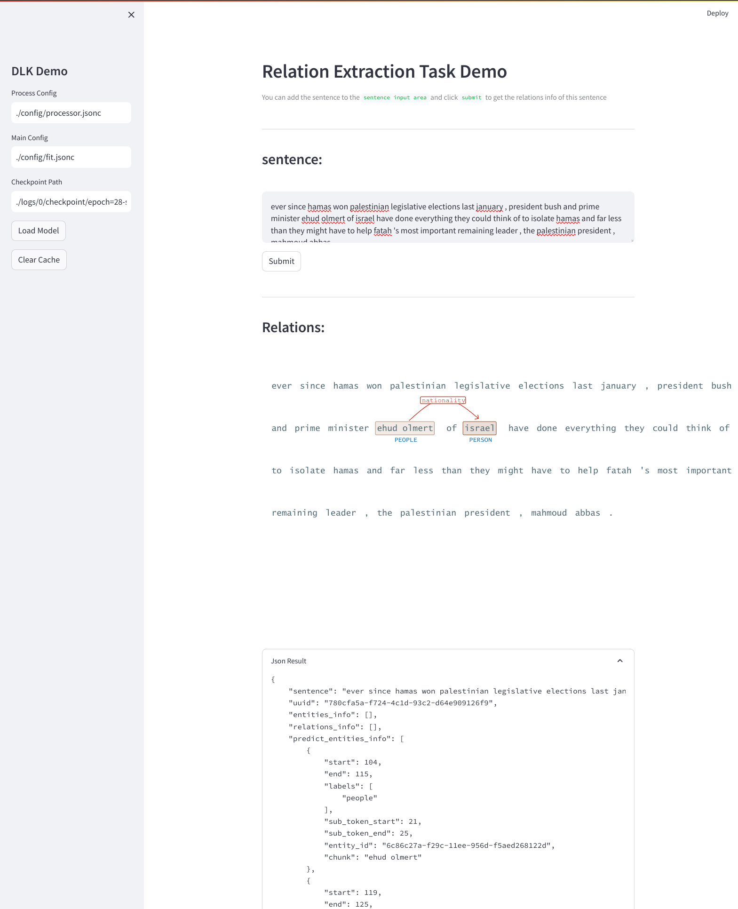
  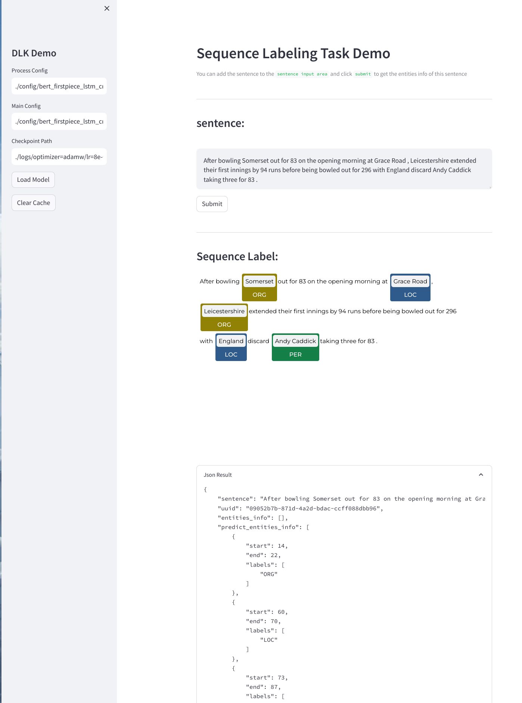
</div>

<div style="display:inline-block">
  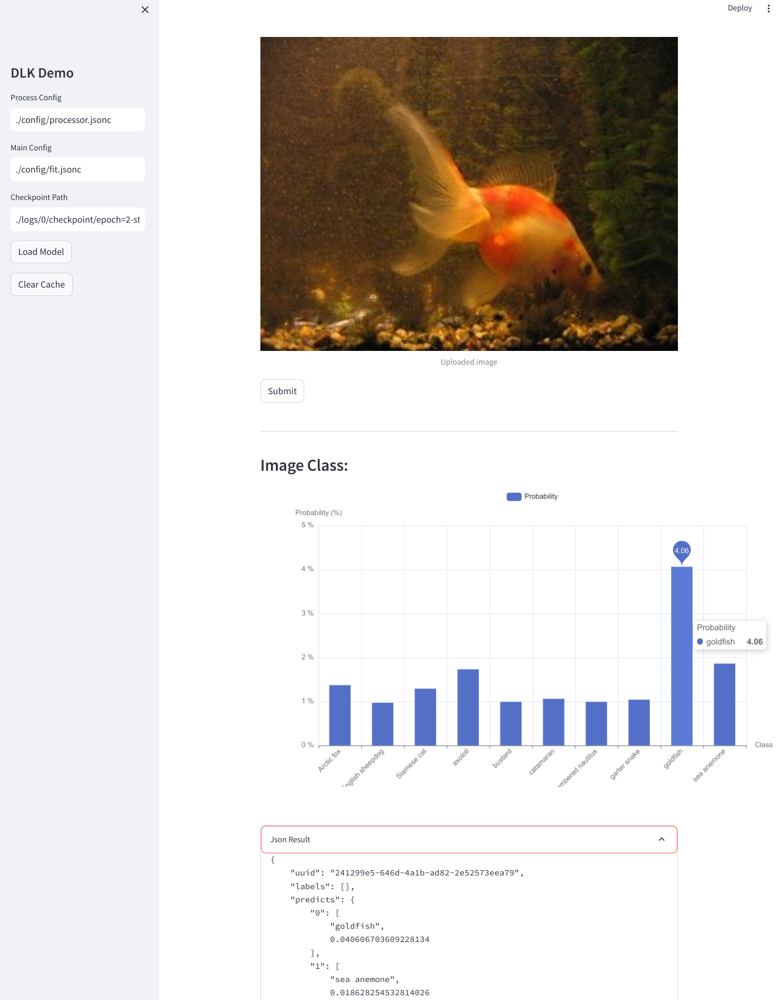
  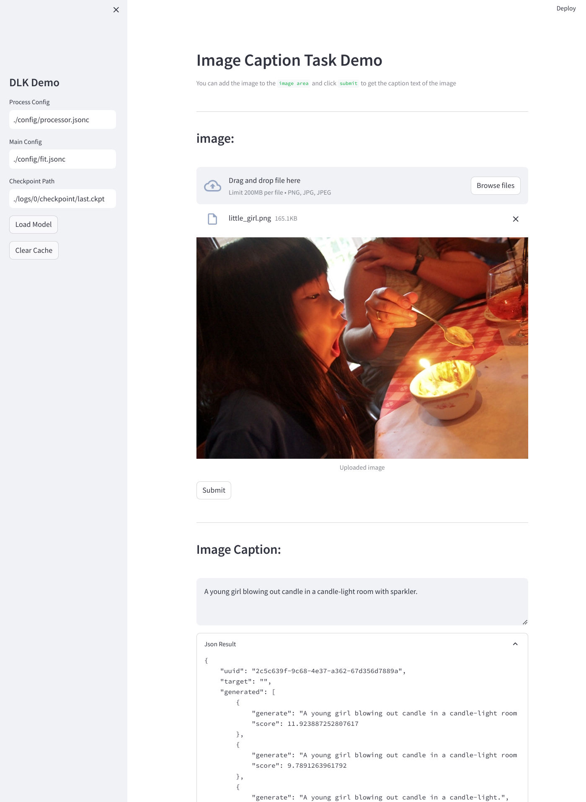
</div>


<div style="display:inline-block">
  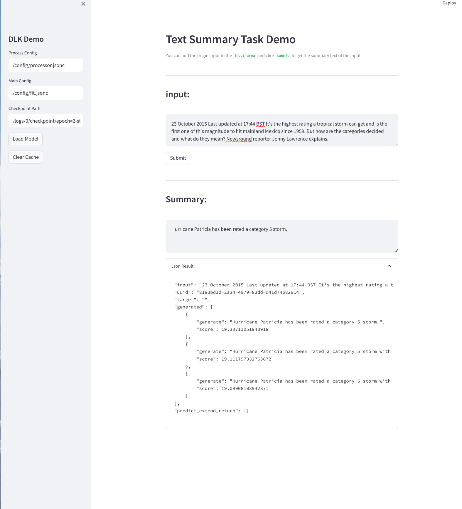
  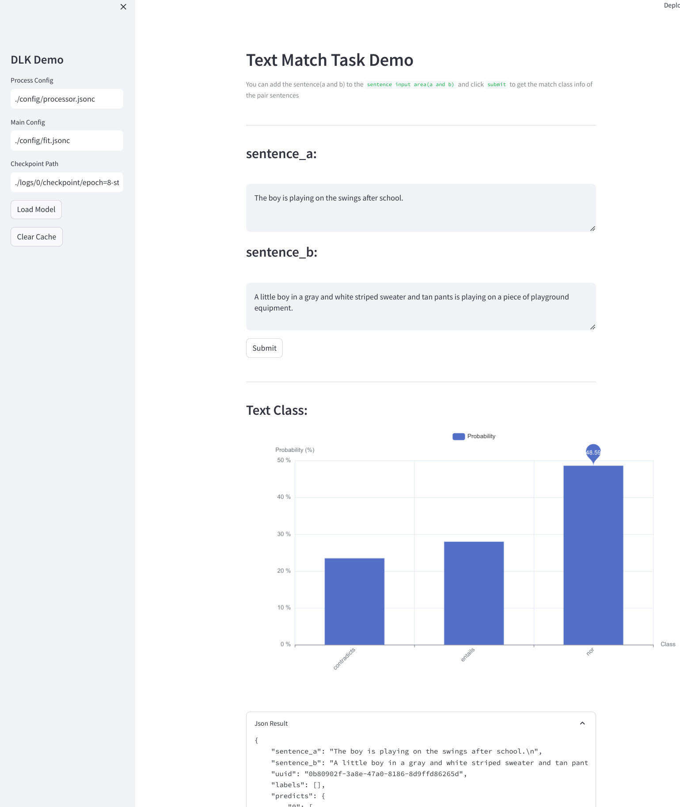
</div>

<div style="display:inline-block">
  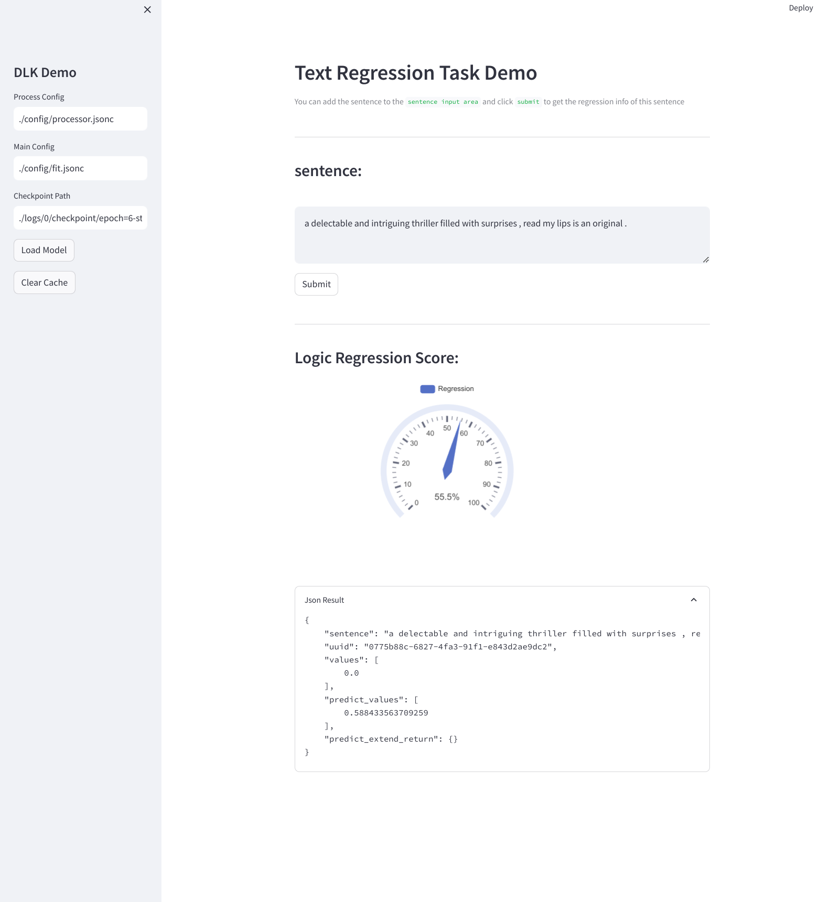
  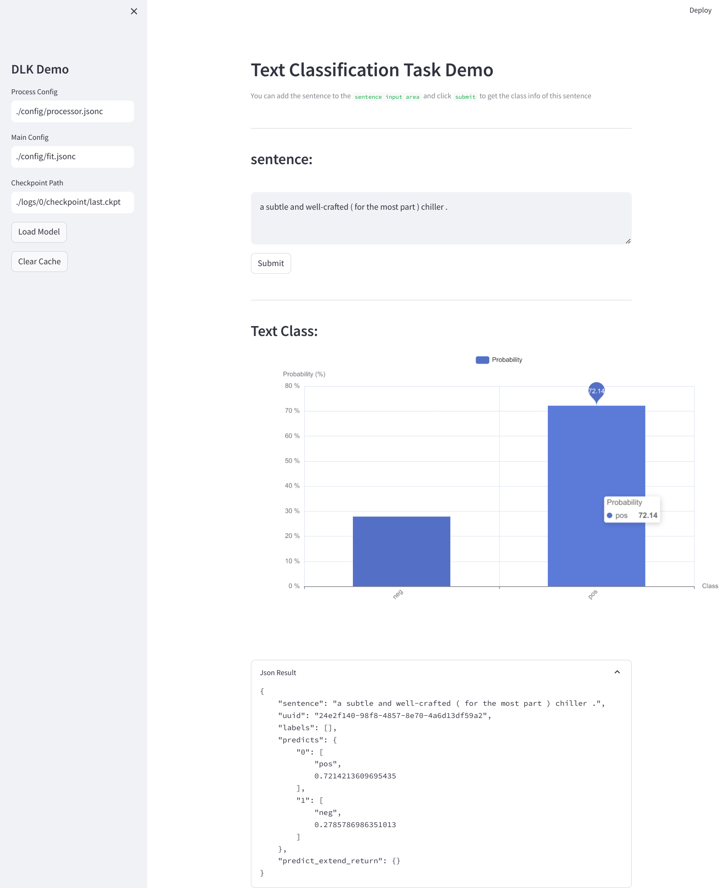
</div>

### Usage and Feature

#### 核心特性

`dlk` 的数据处理引擎已全面升级，基于 HuggingFace `datasets` 库构建，带来以下核心优势：

1.  **高性能数据处理**: 底层采用 Apache Arrow 内存格式，利用内存映射（Memory Mapping）技术，即使处理百 GB 级的数据集，也几乎不占用 RAM。所有 Subprocessor 都支持多进程并行处理，能充分利用现代 CPU 的所有核心。
2.  **无缝断点续传**: `datasets` 的 `.map()` 操作自带智能缓存。当数据处理流水线意外中断时，下次重启会自动从中断处继续，已完成的步骤会秒级加载缓存，无需从头开始。
3.  **统一的在线/离线处理逻辑**: SubProcessor 的核心逻辑被抽象为处理 Python `dict` 的 `process_batch` 方法。离线训练时，`datasets` 库会自动调用它并享受多进程加速；在线推理时，`Server` 可以直接将 API 请求的单条或小批量 `dict` 数据喂给 `process_batch`，无任何 DataFrame 或 Dataset 对象的转换开销，延迟极低。
4.  **分布式训练友好**: `DataModule` 遵循 PyTorch Lightning 的最佳实践。数据处理落盘（`save_to_disk`）在主进程（rank 0）完成，而所有 GPU 进程通过 `load_from_disk` 零拷贝地加载数据，完美解决了 DDP 环境下的数据读取竞争和内存冗余问题。

#### 使用方法

一个常见的 `dlk` 开发任务包含两个 pipeline：数据预处理和模型推理。

**数据预处理 Pipeline**:
-   **入口**: `dlk.preprocess.PreProcessor`
-   **输入**: 在 `process.py` 脚本中，加载你的原始数据（如 json, csv）并构建为 HuggingFace `datasets.Dataset` 对象。
-   **配置**: 编写 `process.jsonc` 来定义 Subprocessor 流水线。将 `train_data_type` 等设置为 `dataset`。
-   **执行**: `PreProcessor` 会高效地处理 `Dataset` 对象，并将结果以 Arrow 格式落盘，以便复用。

**模型训练 Pipeline**:
-   **入口**: `dlk.train.Train`
-   **配置**: 编写 `fit.jsonc` 来配置模型、优化器、损失函数等。`DataModule` 会自动从 `processed_data_dir` 加载预处理好的数据。
-   **执行**: `Train.run()` 启动训练。

**Demo 和部署**:
-   **Demo**: `dlk.demo.Demo` 复用 `process.jsonc` 和 `fit.jsonc` 配置，加载 Checkpoint 即可启动。
-   **部署**: `dlk.server.Server` 实例化后，其 `fit` 方法接收原始数据（如 `dict`），内部调用 `online_process`，实现低延迟推理。

#### 模块注册

DLK 依赖两个注册系统：`intc` 的 `cregister` 和 `dlk` 自身的 `register`。这使得框架具有极高的扩展性。

以`dlk.nn.layer.embedding.static`为例，我们将 `StaticEmbeddingConfig` 以 `("embedding", "static")` 为 key 注册到 `intc` 的 `cregister` 中，以同样的 `key` 将 `StaticEmbedding` 注册到 `dlk` 的模块注册器 `register` 中。

这种机制允许你在自己的项目中轻松扩展 `dlk` 的内置模块，只需使用注册器即可获取，而不必关心其具体实现位置（`register.get("embedding", "static")`)。

#### 部分内置模块介绍

##### callback

`dlk` 的 `Trainer` 基于 `lightning.Trainer`，因此完全兼容 `lightning` 提供的所有 `callback`。`dlk.callback` 中也内置了一些常用 `callback` 的封装。

##### 虚拟对抗训练

对抗训练是提升模型鲁棒性和效果的常用技巧。`dlk` 内置了多种针对 Embedding 层的对抗训练方法（`dlk.adv_method`），如 FGM、PGD 等。参考 `./examples/adv_exp`。

##### 复杂训练控制

`dlk.scheduler` 提供了多种学习率调度策略。`dlk.nn.loss` 中的 `multi_loss` 支持对多个损失函数进行灵活的加权和调度。

##### 文本生成

`dlk` 参考 `fairseq` 的实现，内置了多种 `token_sample` 策略（如 Beam Search、Diverse Beam Search 等），为文本生成任务提供了强大的解码控制能力。

#### 实现你自己的模型

参考 `./examples/001_first_example` 实现你自己的模型。

你可能会觉得这比直接用 PyTorch 写一个模型要复杂。是的，对于简单的单次实验来说或许如此。但 `dlk` 提供了一个**可复用、可扩展、生产就绪**的统一框架。你只需按组件规范实现自己的逻辑，就能免费获得数据处理、训练、验证、参数搜索、部署和 Demo 的全流程能力。你实现的每个组件也都是可复用的。

而且 `dlk` 还提供了很多优化方面的工具，让你不是止步于简单模型。

记住这个包的原则是 **Don't Repeat Yourself**。

#### More Document
TODO
