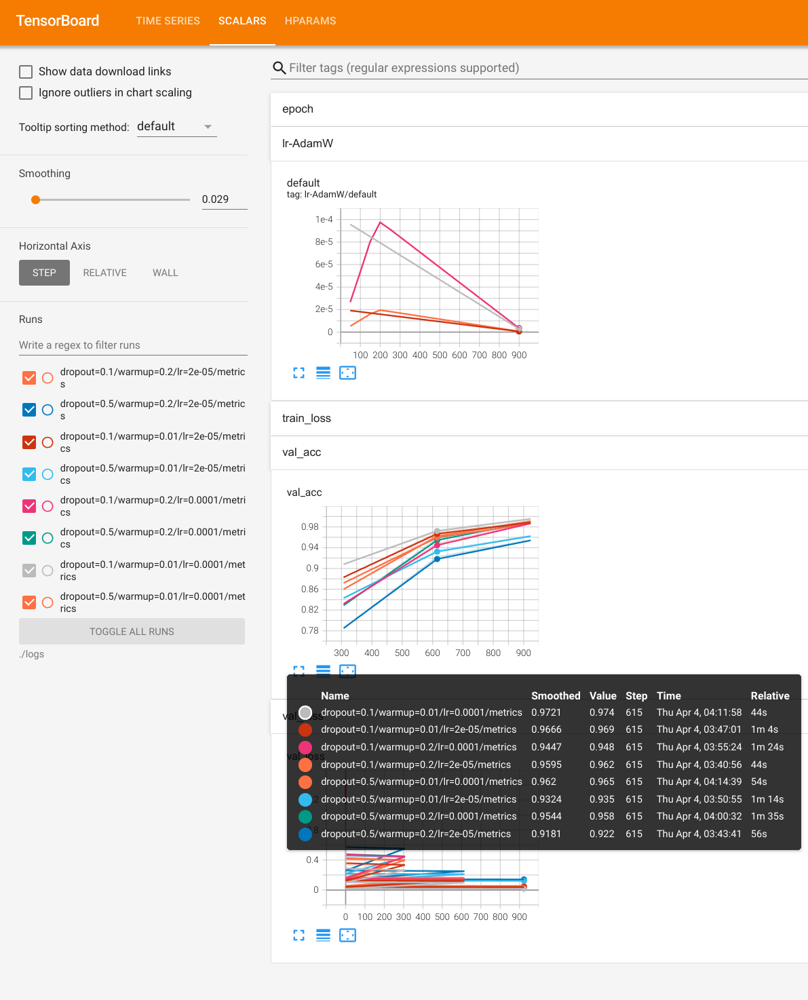

<p align="center">
  <h2 align="center"> Deep Learning toolKit (dlk)</h2>
</p>


<div style="text-align:center">
<span style="width:80%;display:inline-block">


</div>

<h4 align="center">
    <p>
        <b>中文</b> |
        <a href="https://github.com/cstsunfu/dlk/blob/main/README.md">English</a>
    </p>
</h4>


* [Install](#install)
* [Demo](#demo)
    * [Grid Search](#grid-search)
    * [Task Demo](#task-demo)
* [Usage and Feature](#usage-and-feature)
    * [使用方法](#使用方法)
    * [模块注册](#模块注册)
    * [部分内置模块介绍](#部分内置模块介绍)
        * [callback](#callback)
        * [虚拟对抗训练](#虚拟对抗训练)
        * [复杂训练控制](#复杂训练控制)
        * [文本生成](#文本生成)
    * [More Document](#more-document)


在工作中我们经常需要对深度神经网络模型进行快速实验，搜索最优结构和参数，并将最优模型进行部署，有时还需要做出demo进行验证.

训练、预测、部署和demo这几个步骤的核心代码是一致的，但是在实现上都需要一定的的改动，这使得开发过程变得非常割裂，而这造成的代码冗余对于长期的代码维护是灾难性的。

`DLK`是一个使用`lightning`的`Trainer`，`intc`为`config`管理系统的集模型训练、参数（架构）搜索、模型预测、模型部署和`demo`为一身，对于同一个模型实现这些功能只需要依赖一份代码，大大降低开发和维护成本.

同时`DLK`作为一个通用的训练框架，我们的各种训练技巧和增强方法也可以非常方便的用于不同的模型, 为此`DLK`内置了很多有用的组件。

除了基础组件之外，`DLK`还为主要的任务提供了丰富的示例，更多的示例会慢慢添加进来

### Install


```bash
pip install dlk == 0.1.0

# or clone this repo and cd to the project root dir
pip install .
```

### Demo

下面是一些基于`dlk`开发的示例:

NOTE: 由于我目前只有一台拥有一张`AMD Radeon VII 16G`的GPU和32G内存的个人PC，算力十分有限，因此这里示例的参数很多都还没有优化至SOTA


#### Grid Search

`dlk`基于`intc`进行开发，因此同样提供了参数搜索的能力，而`intc`的`_search`并不仅限于数值类型的参数搜索，也可以对整个模块进行搜索，因此`dlk`实际上也具有模块级的架构搜索能力

`./examples/grid_search_exp`里面提供了一个对超参数进行搜索的示例

训练完模型之后执行：

```bash
tensorboard --logdir ./logs
```

<div style="text-align:center">
<span style="width:47%;display:inline-block">


</span>
<span style="width:47%;display:inline-block">

 

</span>
</div>

#### Task Demo

Demo 均位于`examples`目录下，训练完模型后执行：

```bash
streamlit run ./demo.py
```

<div style="text-align:center">
<span style="width:47%;display:inline-block">


</span>
<span style="width:47%;display:inline-block">


</span>
</div>

<div style="text-align:center">
<span style="width:47%;display:inline-block">


</span>
<span style="width:47%;display:inline-block">


</span>
</div>

<div style="text-align:center">
<span style="width:47%;display:inline-block">


</span>
<span style="width:47%;display:inline-block">


</span>
</div>

<div style="text-align:center">
<span style="width:47%;display:inline-block">


</span>

<span style="width:47%;display:inline-block">


</span>
</div>

### Usage and Feature

#### 使用方法

一般来说一个常见的`dlk`开发任务包含两个pipeline，即数据预处理pipeline和模型推理pipeline. *实际上这两个步骤是可以放到同一个pipeline中的, 当前示例中的大多数任务都需要对预处理数据的复用，因此使用两个pipeline*

数据预处理pipeline对应的内置入口是`dlk.preprocess.Process`，我们需要编写`process.jsonc` config文件来对预处理过程(训练、推理、deploy过程全都复用同一个文件，因此配置文件中有针对不同`stage`的不同设置)进行配置并初始化`Process`, 将数据传入并执行`run`即可按要求输出预处理好的数据

模型训练pipeline对应的内置入口是`dlk.train.Train`, 我们需要编写`fit.jsonc` config文件来对模型训练（推理和deploy过程也同样复用这个文件），使用配置文件初始化`Train`之后执行`run`即可获得训练好的模型。

demo则只需要导入训练过程中相同的`process.jsonc`和`fit.jsonc`以及训练好的模型（由`checkpoint` callback组件保存）即可

模型部署只需将`dlk.server.Server`实例化，分发到对应的服务器，通过`Server.fit`接受单条或一个batch的数据即可（TODO: 示例）


#### 模块注册

DLK依赖两个注册系统，一套是`intc`的`config`注册`cregister`，一套是`dlk`自己的模块注册，注册原则是一致的，都是将一个模块以`module_type`和`module_name`为`key`注册到注册器中，之所以选择两层的命名作为`key`是因为这样更方便区分不同的模块类型

以`dlk.nn.layer.embedding.static` 为例，我们将`StaticEmbeddingConfig` 作为`StaticEmbedding`的`config`以`("embedding", "static")`为key注册到`intc`的`cregister`中，以同样的`key`将`StaticEmbedding`注册到`dlk`的模块注册器`register`中。

使用注册器的好处是，我们可以不必关注具体类在哪里实现，只要知道注册的名称就可以直接获取这个类，这使得我们可以非常方便的在任意位置扩展`embedding`的类型，对于我们在自己的项目里面扩展`dlk`非常重要，注册模块对于`intc`也同样重要。在我们已知`StaticEmbedding`的注册名的情况下，获取这个模块的方法非常简单，可以直接`register.get("embedding", "static")`即可，而不必关注他的实际存储位置(`cregister`也有同样的功能)


#### 部分内置模块介绍

##### callback

`dlk`的`Trainer`是基于`lightning.Trainer`实现的，因此`dlk`同样可以使用`lightning`提供的`callback`, `dlk.callback`中包含一些常用的`callback`

##### 虚拟对抗训练

`Adversarial Training`是一种常见的提升模型效果的技巧，`dlk`内置了一些常用的针对`embedding`的`adv`方法(`dlk.adv_method`)，`./examples/adv_exp`是一个使用示例

##### 复杂训练控制

`dlk`的`dlk.scheduler`模块提供了多种的训练`scheduler`， `dlk.nn.loss`模块中的`multi_loss`同样针对多个`loss`提供了自由控制各种`loss`的能力

##### 文本生成

`dlk`还参考`fairseq`的实现，实现了多种的`token_sample`方法，为文本生成提供非常强大的控制能力

#### More Document

TODO
