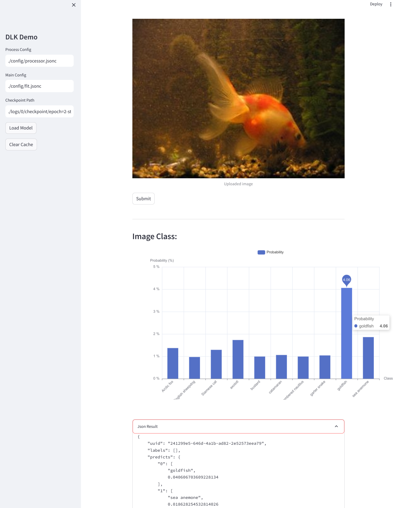

### Image Classification Example(NER)



#### Dataset

Test on the `imagenet-1k` dataset.


#### how to run

0. prepare the model `google/vit-base-patch16-224`

1. Preprocess the data

Update the path to preprocess config `preprocess_config` field at `config/processor.jsonc`

```
python process.py
```

2. Train the model

Update the path to pretrained vit `pretrained_model_path` field at `config/fit.jsonc`
```
python train.py
```
