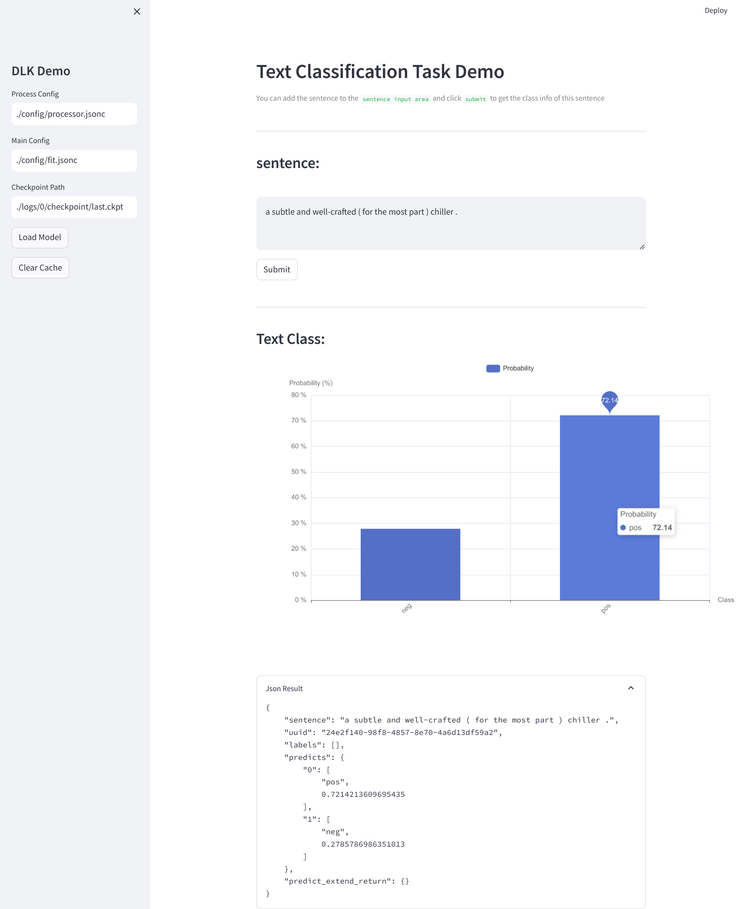

### Text Classification Example



#### Dataset

Test on the sst2 dataset.


#### how to run

1. Preprocess the data

Update the path to tokenizer `tokenizer_path` field at `config/processor.jsonc`
```
python process.py
```

2. Train the model

Update the path to pretrained bert/distilbert `pretrained_model_path` field at `config/fit.jsonc`
```
python train.py
```
